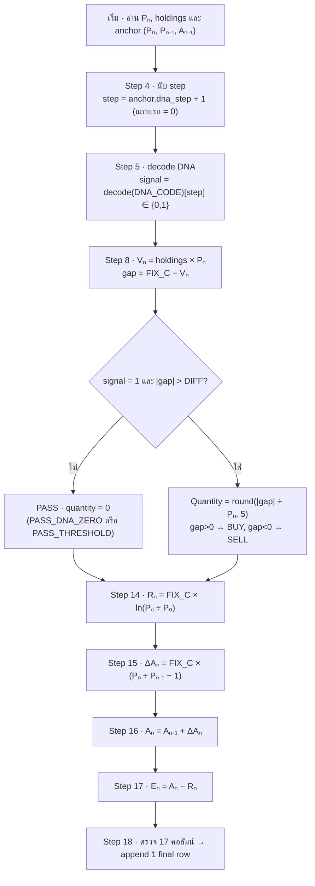
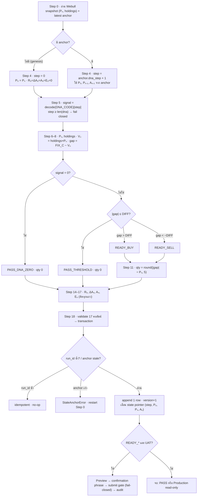

# LEGO Equation Flowchart — Shannon Demon one-new-row pipeline

> reference ของสกิล `webull-api-thai` สำหรับกรณีผู้ใช้ทำกลยุทธ์ **Shannon Demon LEGO** บน Webull (region `th`)
> ใช้เมื่อผู้ใช้ขอ flowchart / diagram / ทางเดินสมการ / เอกสาร decode DNA / gate / step, PASS/BUY/SELL, recurrence Rₙ/ΔAₙ/Aₙ/Eₙ, Step 18 persistence หรือ UAT Preview/Submit gate

สร้างแผนภาพและตารางสมการที่ **ตรงกับ implementation จริงเป๊ะ** เพื่อให้คนอ่านเห็นทางเดินตั้งแต่รับ snapshot จนได้ final row และ persist โดยไม่ต้องอ่านโค้ดก่อน

## แหล่งความจริง (ยึด implementation เสมอ)

ตรวจไฟล์เหล่านี้ก่อนเผยแพร่ หากขัดกับ template ในไฟล์นี้ให้ยึดโค้ดและแจ้งความต่างสั้น ๆ:

| ไฟล์ | ขอบเขต | สัญลักษณ์สำคัญ |
|---|---|---|
| `lego_one_row.py` | Step 0–17: snapshot/anchor, DNA, decision, recurrence, 17 คอลัมน์ | `dna_step_for`, `dna_signal_for`, `build_decision`, `compute_recurrence`, `compute_row`, `build_final_document`, `validate_row_columns` |
| `lego_state.py` | Step 18: transaction, idempotency, stale-anchor guard | `plan_commit`, `commit_final_row`, `_state_document` |
| `lego_orders.py` | เส้นทาง order UAT (Preview/Submit) | `evaluate_submit_gate`, `order_confirmation_phrase`, `summarize_order_result` |
| `manual_tools.py` | ถอด DNA เป็น gate 0/1 | `decode_dna`, `parse_dna_spec`, `dna_summary`, `DEFAULT_ORDER_DECIMAL_PRECISION` |

Firestore 3 collections: `webull_lego_rows/{run_id}` (row immutable), `webull_lego_state/{chain_key}` (pointer + recurrence baseline), `webull_lego_order_audit/{event_id}` (redacted).

> ⚠️ หมายเหตุการนำไปใช้จริง: โค้ด production ของผู้ใช้ (เช่น `main_final_log_all_status.py`, `dna_engine.py`, `strategy.py`, `config.py`) อาจใช้ชื่อโมดูล/ฟังก์ชันต่างจากตารางข้างบน (เช่น `decode_dna` อยู่ใน `dna_engine.py`, decision อยู่ใน `strategy.calculate_shannon_decision`, สถานะจริงมี `PASS_WAITING_TO_START`/`PASS_MARKET_CLOSED`/`TIMELINE_ENDED`/`ORDER_SUBMITTED`) — **เมื่อจะทำ diagram จากโปรเจกต์จริง ให้เปิดไฟล์จริงก่อนแล้วยึดชื่อ/สถานะตามโค้ดนั้น** ตาราง/สมการด้านล่างเป็น canonical model ของกลยุทธ์ ไม่ใช่การรับประกันชื่อสัญลักษณ์ในทุกรีโป

## ค่าคงที่และค่าเริ่มต้น

| ชื่อ | ค่า | ที่มา |
|---|---|---|
| `FIX_C` (`fix_c`) | ต้อง finite และ `> 0` | เป้ามูลค่าพอร์ต |
| `DIFF` (`diff`) | default `0.0`, ต้อง `≥ 0` | ครึ่งความกว้างแถบ no-trade |
| `dna_code` | default `"bypass:100"` | โค้ด DNA |
| `strategy_id` | default `"shannon_demon_lego"` | — |
| `decimal_precision` | default `5` (`DEFAULT_ORDER_DECIMAL_PRECISION`) | ทศนิยม quantity |
| `DECISION_STAGE` | `8` | ก่อน Step 8 สถานะ draft = `SNAPSHOT_READY` |
| สถานะ (5 ค่า) | `SNAPSHOT_READY`, `PASS_DNA_ZERO`, `PASS_THRESHOLD`, `READY_BUY`, `READY_SELL` | `lego_one_row.py` |
| environment | `"Test (UAT)"` = ส่ง order ได้, `"Production"` = read-only | `lego_orders.py` |

> การเปลี่ยน `strategy_id`, `fix_c`, `diff`, `decimal_precision` หรือ DNA ทำให้ `config_hash` เปลี่ยน → **เริ่ม chain ใหม่**

## สัญญา 17 คอลัมน์ (ลำดับตายตัว)

`validate_row_columns` จะ fail closed ถ้าคอลัมน์ไม่ครบ 17 หรือผิดลำดับ

| Step | คอลัมน์ | ค่า/สมการ |
|---|---|---|
| 1 | `เวลา (UTC)` | `snapshot.captured_at` |
| 2 | `สินทรัพย์` | symbol ของ snapshot |
| 3 | `สถานะ` | `SNAPSHOT_READY` จนถึง Step 8 แล้วเป็นสถานะ decision |
| 4 | `DNA step` | `anchor.dna_step + 1` (แถวแรก = `0`) |
| 5 | `DNA signal` | `decode_dna(DNA_CODE)[dna_step]` ∈ `{0,1}` |
| 6 | `ราคา Pₙ (USD)` | live quote (`> 0`) |
| 7 | `จำนวนถือครอง (หุ้น)` | live position (`0` ถ้าไม่มี) |
| 8 | `คำสั่ง` | `action` จาก `build_decision` (สร้างครั้งเดียว) |
| 9 | `ฝั่ง` | `side` (`PASS` = ว่าง) |
| 10 | `เหตุผล` | `reason` = สถานะ decision |
| 11 | `จำนวนสั่ง (หุ้น)` | `round(abs(gap)/Pₙ, decimal_precision)`; PASS = `0` |
| 12 | `มูลค่าพอร์ต (USD)` | `Vₙ = holdings × Pₙ` |
| 13 | `ส่วนต่างเป้าหมาย (USD)` | `gap = FIX_C − Vₙ` |
| 14 | `Rₙ อ้างอิง (USD)` | `FIX_C · ln(Pₙ / P₀)` |
| 15 | `ΔAₙ ต่อสเต็ป (USD)` | `FIX_C · (Pₙ / Pₙ₋₁ − 1)` |
| 16 | `Aₙ สะสม (USD)` | `Aₙ₋₁ + ΔAₙ` |
| 17 | `Eₙ ส่วนเกินสะสม (USD)` | `Aₙ − Rₙ` |

> **Step 8 สร้าง decision ครั้งเดียว** — `Vₙ`, `gap`, `action`, `side`, `reason`, `quantity` มาจาก object เดียว; Step 9–13 แค่เปิดเผยค่าจาก object นั้น (ลำดับเปิดเผยต่างจากลำดับคำนวณ)
> คอลัมน์เงิน 7 ตัว (6, 12–17) เก็บ full precision แล้ว round 2 dp เฉพาะตอนแสดง/ส่งออก (`columns_presented`); quantity round ตาม `decimal_precision`

## สมการ (legend)

| ค่า | สมการ/กฎ |
|---|---|
| DNA step | `anchor.dna_step + 1` (แถวแรก = `0`) — **+1 ทุกแถวเสมอ** |
| DNA signal (gate) | `decode_dna(DNA_CODE)[dna_step]` ∈ `{0,1}` |
| มูลค่าพอร์ต `Vₙ` | `holdings × Pₙ` |
| Target gap | `FIX_C − Vₙ` |
| Quantity | `round(abs(gap) / Pₙ, 5)` (PASS = 0) |
| Reference `Rₙ` | `FIX_C × ln(Pₙ / P₀)` |
| Delta actual `ΔAₙ` | `FIX_C × (Pₙ / Pₙ₋₁ − 1)` |
| Actual cumulative `Aₙ` | `Aₙ₋₁ + ΔAₙ` |
| Excess `Eₙ` | `Aₙ − Rₙ` |

แถวแรก (ไม่มี anchor): `P₀ = Pₙ` และ `R₀ = ΔA₀ = A₀ = E₀ = 0`

## Invariants / guards (fail closed ทั้งหมด)

1. **อินพุตเดียว:** อ่าน current snapshot (Pₙ, holdings) + latest anchor หนึ่งแถวเท่านั้น — ไม่ลาก history หลายแถว
2. **DNA decode ถูกล็อกตาม slot:** `decode_dna` ให้อาเรย์ `0/1` ความยาวคงที่ (`bypass:N` = 1 ครบ N ช่อง; spec ใช้ seed+mutation), `dna[0] = 1` เสมอ; index = slot เวลา
3. **step +1 ทุกแถวเสมอ:** ทุกแถวใหม่กิน 1 slot ไม่ว่า PASS หรือเทรด; ห้ามข้าม/ซ้ำ; `step ≥ len(dna)` → fail closed (`"DNA exhausted"`)
4. **gate:** `signal = 0` → บังคับ `PASS_DNA_ZERO` (quantity 0); `signal = 1` จึงพิจารณา gap
5. **decision band:** `|gap| ≤ DIFF` → `PASS_THRESHOLD`; `gap > DIFF` → `READY_BUY`; `gap < −DIFF` → `READY_SELL`
6. **recurrence คิดทุกแถว:** `Rₙ→ΔAₙ→Aₙ→Eₙ` ขึ้นกับราคา/anchor เท่านั้น ไม่ขึ้นกับ decision; ราคา ≤ 0 หรือ `p0/prev_price ≤ 0` → fail closed
7. **Step 18 idempotent:** `run_id = hash(chain_key, anchor.version, snapshot)[:32]`; กดซ้ำด้วย snapshot/anchor เดิม → no-op ไม่สร้างเอกสารซ้ำ
8. **Step 18 stale-anchor + monotonic:** `anchor.version` ต้องเท่ากับ `state.version` มิฉะนั้น `StaleAnchorError` ("restart Step 0"); commit ได้ทำ `version = current + 1` และเลื่อน state pointer (`dna_step`, `p0`, `prev_price=Pₙ`, `prev_actual=Aₙ`) → เป็น anchor ของแถวถัดไป
9. **UAT เท่านั้น:** Preview/Submit ใช้ได้เฉพาะ `Test (UAT)` และหลัง Step 18 persist แถว `READY_BUY/READY_SELL`; `evaluate_submit_gate` fail-closed (payload valid + preview ตรง + confirmation phrase ตรง + ไม่ใช่ Production); Production block เสมอ
10. **ไม่โม้ fill:** `summarize_order_result` เรียก `FILLED` เฉพาะสถานะ filled ชัดเจน; `SUBMITTED/PENDING` ไม่นับเป็น realized

## Workflow

1. ตรวจ source ตามตาราง "แหล่งความจริง" เฉพาะส่วนที่เกี่ยวข้อง แล้วยึดค่าจริง
2. เลือกแผนภาพ:
   - ผู้ใช้ขอ "แบบง่าย" / "ทางเดินสมการ" → **แผนภาพ A** (เส้นทางสมการ ~12 nodes)
   - ผู้ใช้ขอภาพเต็ม decision/persist/UAT → **แผนภาพ B** (canonical)
3. ตามด้วยตารางสมการ (legend) เสมอ และอธิบายแต่ละสมการไม่เกินหนึ่งประโยค
4. ใช้ชื่อ variable/สถานะเดิมให้สม่ำเสมอ และคง Step number ให้ตรงตาราง 17 คอลัมน์

## แผนภาพ A — เส้นทางสมการ (ต้น → จบ)



## แผนภาพ B — Canonical full path



## 🎯 ขั้นตอนการเทรดจริง — LEGO × Webull OpenAPI (region `th`)

> ส่วนนี้คือ "ทำยังไงให้เทรดได้จริง": เอาความรู้ Webull OpenAPI จาก [SKILL.md](../SKILL.md) มาต่อกับ decision ของ LEGO/Shannon Demon
> อ้างอิงโค้ด production จริงของผู้ใช้: `main_final_log_all_status.py` (runtime loop), `strategy.evaluate_rebalance` (decision), `dna_engine.decode_dna`/`DNADecoder` (DNA), `config.get_config` (พารามิเตอร์)

### 0. เตรียมก่อนเทรด (ครั้งเดียว)

| สิ่งที่ต้องมี | รายละเอียด | ref |
|---|---|---|
| App Key / App Secret / Account ID | เก็บใน Secret Manager (`webull-app-key`, `webull-app-secret`, `webull-account-id`) — **ห้าม hardcode** | [SKILL.md §Authentication] |
| region | `"th"` (config env `WEBULL_REGION=TH`) | — |
| endpoint | UAT `th-api.uat.webullbroker.com` → ทดสอบก่อน, Prod `api.webull.co.th` | [endpoints.md](endpoints.md) |
| 2FA token | ยืนยันในแอป Webull ครั้งแรก แล้ว SDK reuse (`set_token_dir`) | [SKILL.md §Authentication] |
| Market data subscription | ต้องมี OpenAPI LV1+ ไม่งั้น `get_snapshot` = 403 | [SKILL.md §Market Data] |
| พารามิเตอร์กลยุทธ์ | `fix_c` (เป้ามูลค่าพอร์ต เช่น 1500), `p0` (ราคาอ้างอิง เช่น 6.88), `diff` (แถบ no-trade เช่น 60), `symbol`, `dna_code` | `config.get_config` |

### 1. init clients (SDK ทำ signature + token ให้อัตโนมัติ)

```python
from webull.core.client import ApiClient
from webull.trade.trade_client import TradeClient
from webull.data.data_client import DataClient

api_client = ApiClient(app_key, app_secret, "th")
api_client.add_endpoint("th", endpoint)      # UAT ก่อน แล้วค่อยสลับ prod
api_client.set_token_dir(token_dir)          # cache token หลัง 2FA
trade_client = TradeClient(api_client)
data_client  = DataClient(api_client)
```

### 2. Guard ก่อนตัดสินใจ (fail closed — ตรงกับ `rebalance_trigger`)

ตามลำดับ ถ้าตกข้อไหนให้ log + return ทันที ไม่เทรด:
1. `now < start_timestamp` → `PASS_WAITING_TO_START`
2. `not is_us_market_open()` → `PASS_MARKET_CLOSED`
3. อ่าน `dna_step` จาก Firestore state; `dna_step ≥ len(decode_dna(dna_code))` → `TIMELINE_ENDED`
4. `signal = decode_dna(dna_code)[dna_step]` แล้ว **increment dna_step ทันที** (จอง slot); `signal == 0` → `PASS_DNA_ZERO`

> DNA decode: string length-encoded → PCG64 (`np.random.default_rng(seed)`) เป็นอาเรย์ 0/1, `dna[0]=1` เสมอ, ใส่ mutation ตาม seed (ดู `DNADecoder.decode_to_flags`)

### 3. ดึงสถานะตลาดจริงจาก Webull (เฉพาะเมื่อ signal = 1)

```python
# ตำแหน่งที่ถืออยู่
positions = trade_client.account_v2.get_account_position(account_id).json()
qty = extract_qty(positions, symbol)          # ไม่มี = 0.0

# ราคาล่าสุด (ต้องมี market data subscription)
snap = data_client.market_data.get_snapshot(
    symbol.upper(), "US_STOCK",
    extend_hour_required=False, overnight_required=False).json()
last_price = extract_price(snap, symbol)       # ต้อง > 0
```

### 4. คำนวณ decision ด้วยสูตร Shannon Demon (`strategy.evaluate_rebalance`)

```python
value_now = qty * last_price
rebalance = abs(fix_c - value_now)
baseline  = fix_c * math.log(last_price / p0)     # last_price ≤ 0 → fail closed

if rebalance <= diff:
    action = "PASS"                                # → PASS_THRESHOLD
elif value_now < fix_c - diff:                     # พอร์ตต่ำกว่าเป้า → ซื้อ
    side, action = "BUY", "TRIGGER_ACTION"
    order_qty = math.floor((fix_c - value_now)/last_price * 1e4)/1e4   # floor 4dp
else:                                               # พอร์ตเกินเป้า → ขาย
    side, action = "SELL", "TRIGGER_ACTION"
    order_qty = math.ceil((value_now - fix_c)/last_price * 1e4)/1e4    # ceil 4dp
    order_qty = min(order_qty, math.floor(qty*1e4)/1e4)   # ห้ามขายเกินที่ถือ
if order_qty <= 0: action = "PASS"
```

**mapping สถานะ LEGO ↔ runtime จริง:** `PASS_DNA_ZERO`=signal 0 · `PASS_THRESHOLD`=`rebalance≤diff` · `READY_BUY`/`READY_SELL`=`TRIGGER_ACTION`+side

### 5. ส่งคำสั่งจริงไป Webull (เฉพาะ `TRIGGER_ACTION`)

```python
import uuid
client_order_id = uuid.uuid4().hex     # unique/idempotent กันสั่งซ้ำ
order = [{
    "combo_type": "NORMAL", "client_order_id": client_order_id,
    "symbol": symbol.upper(), "instrument_type": "EQUITY", "market": "US",
    "order_type": "MARKET", "quantity": f"{order_qty:.5f}".rstrip("0").rstrip("."),
    "side": side, "time_in_force": "DAY", "entrust_type": "QTY",
    "support_trading_session": support_trading_session,   # เช่น "CORE"
}]

order_api = trade_client.order_v3            # ตาม api_version ที่ config
if preview_orders:                            # แนะนำเปิดใน UAT
    order_api.preview_order(account_id, order)
res = order_api.place_order(account_id, order).json()   # → ORDER_SUBMITTED
```

### 6. ปิด loop ให้สำเร็จ

- **บันทึก log ทุก path** (`PASS_*`, `ORDER_SUBMITTED`, `ERROR`) ลง Firestore เพื่อ dashboard ไม่ว่าง — trade อย่าล้มเพราะ log ล้ม (best-effort)
- **รับสถานะ fill จริง** ด้วย gRPC Trade Events (`ORDER_STATUS_CHANGED`) แทนการเดา — MARKET order ที่ `SUBMITTED` ยังไม่ใช่ `FILLED` (ดู [SKILL.md §Trade Events])
- **dna_step เดินหน้าเสมอ** ไม่ว่าจะเทรดหรือ PASS (จองไปแล้วใน step 2.4)

### ✅ Checklist ให้เทรดสำเร็จ

1. ☐ ทดสอบบน **UAT** (`th-api.uat.webullbroker.com`) + `preview_orders=True` ให้ผ่านก่อน แล้วค่อยสลับ prod
2. ☐ มี **market data subscription** สำหรับ OpenAPI (ไม่งั้น snapshot 403)
3. ☐ ยืนยัน **2FA** ครั้งแรก + cache token (`set_token_dir`)
4. ☐ `last_price > 0`, `qty ≥ 0`, `fix_c > 0`, `diff ≥ 0`, `p0 > 0` — ไม่งั้น fail closed
5. ☐ `client_order_id` unique ทุกคำสั่ง (กันสั่งซ้ำ)
6. ☐ SELL ไม่เกินจำนวนที่ถือจริง (clamp)
7. ☐ เคารพ **rate limit** place order 15/s ([endpoints.md](endpoints.md))
8. ☐ credential อยู่ใน Secret Manager ไม่ commit ขึ้น repo

> ⚠️ Webull OpenAPI ส่ง order ได้เฉพาะ environment ที่อนุญาต — เริ่มที่ UAT เสมอ, ทวนสถานะ `FILLED` จาก event จริง ไม่โม้ fill จาก response `SUBMITTED`

## Output rules

- เริ่มด้วยแผนภาพทันที ไม่เกริ่นยาว; ค่าเริ่มต้นใช้ **แผนภาพ A**, ใช้ **แผนภาพ B** เมื่อผู้ใช้ขอภาพเต็ม
- ใช้ชื่อเดิมสม่ำเสมอ: `FIX_C`, `DIFF`, `P₀`, `Pₙ`, `Pₙ₋₁`, `Aₙ₋₁` และสถานะทั้ง 5
- อธิบายแต่ละสมการไม่เกินหนึ่งประโยค; ทุกตัวเลข/สูตรต้องตรงตาราง 17 คอลัมน์และ legend
- หาก Mermaid renderer ไม่รองรับอักษรห้อย ให้คงสมการใน code span และกำกับชื่ออังกฤษ
- หากผู้ใช้ขอไฟล์ ให้บันทึกเป็น Markdown ที่มี Mermaid หรือแปลงเป็นรูป/HTML ตามที่ผู้ใช้ระบุ
- หากพบว่าโค้ดต่างจากไฟล์นี้ ให้ยึดโค้ด แก้แผนภาพ และระบุความต่างให้ผู้ใช้ทราบ
