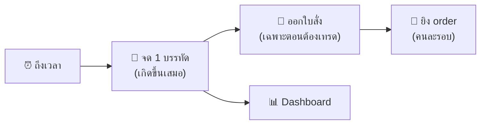

# 🚀 START HERE — เข้าใจระบบนี้ใน 5 นาที

> อยาก deploy จริงจัง? ไปที่ [`QUICKSTART_TH.md`](QUICKSTART_TH.md)
> ไฟล์นี้คือ "อ่านแล้วรู้เรื่องทันที" สำหรับคนเพิ่งมาถึง

---

## 🤖 ระบบนี้คืออะไร (30 วินาที)

มีหุ่นยนต์ 2 ตัวทำงานคนละหน้าที่ **ไม่ยุ่งกัน**

| หุ่นยนต์ | หน้าที่ | ถ้ามันพัง |
|---|---|---|
| 📓 **คนจดสมุด** (`lego_one_row`) | ทุกช่วงเวลาตลาด จดราคา คำนวณ แล้วบันทึก 1 บรรทัด | ขาดข้อมูล 1 บรรทัด |
| 🏃 **คนวิ่งส่งของ** (`lego_order_worker`) | หยิบใบสั่งไปยิงที่ Webull แล้วตามผล | order ไม่ออก **แต่สมุดยังจดต่อ** |

**กฎเหล็ก:** คนวิ่งล้ม ห้ามลากคนจดล้มตาม เพราะ DNA ถูกฝึกมาให้เดินตามเวลาตลาด ถ้าหยุดรอ order = เดินผิดจังหวะทั้งวัน



---

## 🧬 DNA คืออะไร (1 นาที)

DNA = สตริงตัวเลขที่ถอดออกมาเป็นชุด **เปิด/ปิด** ยาวเท่าจำนวนช่องเวลา

```
DNA array:  [1, 0, 0, 1, 1, 0, ...]
ช่องที่:      0  1  2  3  4  5
             ↑           ↑  ↑
            เทรดได้     เทรดได้
```

- `1` = ช่องนี้ **อนุญาต**ให้พิจารณาเทรด
- `0` = ช่องนี้ **ข้าม** ไม่ว่าราคาจะน่าเทรดแค่ไหน

DNA ถูกฝึกมากับกราฟย้อนหลังทีละแท่ง **ช่องที่ 5 ในระบบจริงต้องเป็นแท่งที่ 5 ตอนฝึก** ไม่งั้นเหมือนเปิดโน้ตเพลงผิดบรรทัด

---

## 👀 เปิดไปดูตรงไหน

**Firebase Realtime Database** — 3 ที่ที่ควรดู

| path | คืออะไร |
|---|---|
| `webull_lego_rows` | สมุดบันทึก ทุกบรรทัดที่เคยจด |
| `webull_lego_state` | หน้าที่ค้างไว้ (จดถึงช่องไหนแล้ว) |
| `webull_lego_order_outbox` | ใบสั่งที่รอคนวิ่งมาหยิบ |

**Streamlit** — หน้าจอสวย ๆ ดูตาราง กราฟ และผลตรวจสมการ (E1–E8)

---

## 📖 อ่าน 1 บรรทัดให้เป็น

17 คอลัมน์ จำแค่ 4 กลุ่มพอ

| กลุ่ม | คอลัมน์ | อ่านว่า |
|---|---|---|
| 🕐 เกิดตอนไหน | เวลา, สินทรัพย์, DNA step, DNA signal | ช่องที่เท่าไร ประตูเปิดไหม |
| 💰 ตอนนั้นมีอะไร | ราคา, จำนวนถือครอง, มูลค่าพอร์ต | พอร์ตเท่าไรตอนนั้น |
| 🎯 ตัดสินใจว่าไง | สถานะ, คำสั่ง, ฝั่ง, เหตุผล, จำนวนสั่ง, ส่วนต่างเป้าหมาย | ซื้อ ขาย หรือผ่าน |
| 📈 กำไรสะสม (ทฤษฎี) | Rₙ, ΔAₙ, Aₙ, Eₙ | ทำได้ดีกว่าถือเฉย ๆ แค่ไหน |

**ดูตัวเดียวก่อนเลย: `สถานะ`**

| สถานะ | แปลว่า |
|---|---|
| `PASS_DNA_ZERO` | DNA ปิดประตูช่องนี้ 🚪 |
| `PASS_THRESHOLD` | ประตูเปิด แต่พอร์ตยังใกล้เป้า ไม่คุ้มขยับ |
| `READY_BUY` | ต้องซื้อเพิ่ม 🟢 |
| `READY_SELL` | ต้องขายออก 🔴 |

**แล้วดู `Eₙ`** — ตัวเลขนี้คือ "ส่วนเกิน" ถ้าเป็นบวกแปลว่าการเด้งไปมาของราคาทำเงินให้เรา นี่คือหัวใจของกลยุทธ์

> ⚠️ Rₙ/ΔAₙ/Aₙ/Eₙ เป็น **ตัวเลขทฤษฎี** กำไรจริงจาก broker อยู่คนละที่ (`webull_lego_realized`) อย่าเอาไปปนกัน

---

## 🛟 ปุ่มความปลอดภัย 2 อัน

```
WEBULL_ENV=UAT      # สนามซ้อม ไม่ใช่เงินจริง
AUTO_SUBMIT=false   # ไม่ยิง order อัตโนมัติ
```

มือใหม่อยู่กับ 2 ค่านี้ไปก่อน ระบบยังจดสมุดครบ ดู dashboard ได้เต็ม แค่ไม่มีเงินขยับ

---

## 🔍 เห็นแบบนี้ แปลว่าอะไร

| เห็น | แปลว่า | ต้องตกใจไหม |
|---|---|---|
| `ROW_COMMITTED` | จดสำเร็จ | 🎉 |
| `MARKET_CLOSED` | ตลาดปิดอยู่ | ไม่ |
| `SLOT_CONSUMED` | ช่องนี้จดไปแล้ว | ไม่ (ยิงถี่กว่าช่อง) |
| `CONFIG_ERROR` | ตั้ง `LEGO_SLOT_SECONDS` ผิด | ใช่ แก้ก่อน |
| `CALENDAR_DRIFT` | ปฏิทินเปลี่ยนกลางทาง | ใช่ ระบบกันไว้ให้แล้ว |
| `EXPIRED_UNSENT` | ใบสั่งหมดอายุก่อนถูกส่ง | ตั้งใจ — ราคาเก่าแล้ว ไม่ส่งดีกว่า |

---

## 🎮 ลองเล่นเลย 3 คำสั่ง

```bash
# 1. รันเทสต์ทั้งชุด (ไม่ต้องมี Firebase/Webull)
pip install -r requirements.txt pytest && pytest -q

# 2. ดูว่านาฬิกาตลาดแบ่งช่องยังไง
LEGO_SLOT_SECONDS=1800 LEGO_DNA_ORIGIN_UTC=2026-07-23T13:30:00Z python -c "
from datetime import datetime, timezone
from market_clock import resolve_market_slot
s = resolve_market_slot(datetime(2026,7,23,15,0,tzinfo=timezone.utc))
print(s.slot_id, s.market_ordinal)"

# 3. ถอด DNA ดูว่าเปิดกี่ช่อง
python -c "
from dna_engine import decode_dna
dna = decode_dna('26021034252903219354832053493')
print('ยาว', len(dna), 'ช่อง · เปิด', sum(dna), 'ช่อง')
print(dna[:20])"
```

---

## 🗺️ ไปต่อทางไหน

| อยากทำอะไร | ไปที่ |
|---|---|
| deploy ขึ้น Google Cloud จริง | [`QUICKSTART_TH.md`](QUICKSTART_TH.md) |
| ให้ DNA เดินตามเวลาตลาดจริง | `QUICKSTART_TH.md` หัวข้อ 7.5 + `python find_origin.py` |
| เข้าใจสมการทุกบรรทัด | ถาม Claude ด้วย skill `lego-equation-flowchart` |
| แก้โค้ด | อ่าน `lego_one_row.py` ก่อน — สั้นและเป็นหัวใจของทั้งระบบ |

สนุกกับมัน 🎉 ระบบออกแบบมาให้ **พังแบบปลอดภัย** ทุกทาง ผิดพลาดแล้วมันจะหยุดและบอก ไม่ใช่เดินหน้ามั่ว ๆ
